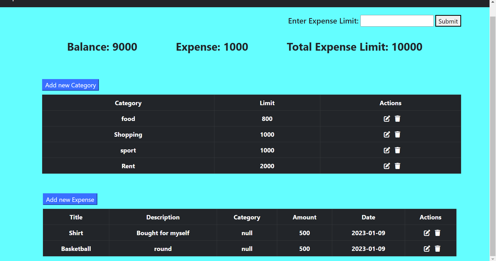
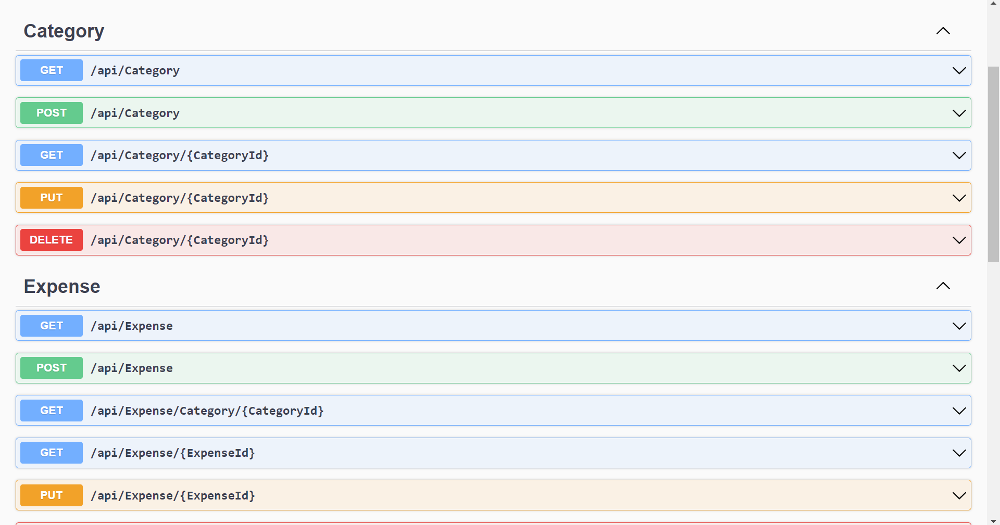

# Welcome to Expense Tracker!

Hi! I'm your guide to Expense Tracker Application. This Application allows you to monitor and Categorize your Expenses. This Money Manager Application helps to keep accurate record of your money inflow and outflow. Application allows user to create and manage various Categories and their Expenses.

# Prerequisites

- Visual Studio (2022)
- .NET Framework
- .NET Core
- Microsoft SQL Management Server
-  NUGet packages
	- ASP.NET Core entity framework
	- ASP.NET Core SQL Server
	- ASP.NET Core Tools
	- ASP.NET Core Design
	- ASP.NET Core Cors
	- Swagger

## Steps for installation
step 1: open project in visual studio
step 2: install all the NUGet packages
step 3: use command update-database in your package manager
step 4: run the program
step 5: let the swagger run
step 6: open the Dashboard.html from the directory

## Screenshots

 
